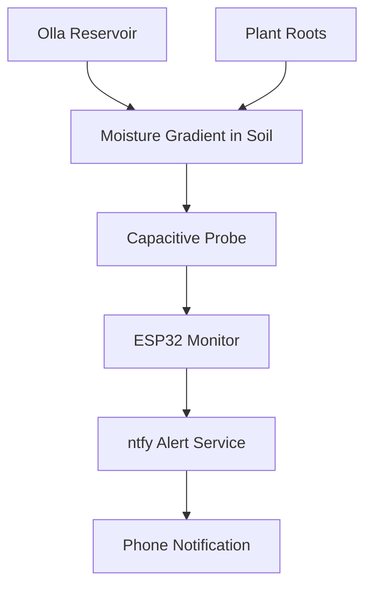

# Homestead Monitoring

Desert-ready automated soil moisture monitoring for a porch garden using:
- **Olla irrigation** (passive watering)
- **ESP32** (active monitoring brain)
- **Solar power** (off-grid)
- **ntfy** (phone push alerts)

This project is designed for hot, dry climates where plants can decline quickly if the root zone dries out. The goal is to avoid crop loss by getting early warnings before stress becomes visible.

## 1) Project Goals

- Keep fruit and vegetable root zones in a healthy moisture range throughout the season.
- Alert when moisture falls below tolerance so the Olla can be refilled before plants show stress.
- Run reliably outdoors through high heat, UV exposure, and dust.
- Start with a single bed/zone and support expansion to multiple zones over time.

## 2) How the System Works

1. A capacitive soil moisture sensor is placed in the root zone, near (but not touching) the Olla.
2. The ESP32 wakes on a schedule and reads the sensor.
3. Readings are filtered and converted to a moisture percentage using dry/wet calibration values.
4. If moisture stays below a set threshold for a sustained period, the ESP32 sends an `ntfy` push alert to your phone.
5. You refill the Olla reservoir. Once soil moisture recovers above the recovery threshold, the system sends a confirmation and clears the alert state.



Olla = passive water delivery.
ESP32 monitor = active early-warning system.


## 3) Recommended Shopping List (BOM)

### Core Electronics (Required)

- **ESP32 Dev Board**
  - Example: DOIT DevKit V1, NodeMCU-32S
  - Buy: [DOIT DevKit V1](https://www.amazon.com/ESP32-WROOM-32-Development-ESP-32S-Bluetooth-forArduino/dp/B08PCPJ12M)
  - Requirements: 3.3V logic, Wi-Fi support, accessible ADC pins
- **Waterproof Capacitive Soil Moisture Sensor** (buy 2x)
  - Buy: [DFRobot SEN0308](https://www.dfrobot.com/product-2054.html)
  - Key specs: IP65 body, analog output (0–3V), 3.3–5.5V supply, 1.5m cable
  - Capacitive design avoids the corrosion issues common with resistive sensors
- **DS18B20 Waterproof Temperature Probe** (optional but strongly recommended)
  - Example: [5pcs DS18B20 Temp Sensor](https://www.amazon.com/HiLetgo-DS18B20-Temperature-Stainless-Waterproof/dp/B00M1PM55K)
  - Used for soil or shaded ambient temperature context; helpful for seasonal calibration tuning
- **IP65+ Enclosure**
  - Example: [8x6x4 IP67 Enclosure](https://www.amazon.com/YETLEBOX-Waterproof-Electrical-Stainless-Enclosure/dp/B0BZHGCBTH)
  - UV-stable plastic, cable glands, gasketed lid
- **Outdoor-rated wiring and heat-shrink**
  - UV-resistant cable jacket preferred; standard PVC degrades quickly in desert sun

### Solar Power (Required for This Setup)

- **Solar panel:** 6V to 12V, 10W typical starter size
  - Example: [10W 12V Solar Panel](https://www.amazon.com/Newpowa-Polycrystalline-Efficiency-Module-Marine/dp/B00W80N8TA)
- **Battery:** LiFePO4 6.4V or 12.8V pack (capacity based on autonomy goal)
  - Example: [LiFePO4 6V](https://www.amazon.com/LiFePO4-Rechargeable-Phosphate-Emergency-Terminals/dp/B09WYF8GP7)
  - LiFePO4 preferred over Li-ion for its thermal stability in high-heat environments
- **Charge controller:** Compatible with your panel voltage and LiFePO4 chemistry
- **Buck converter:** Stable 5V regulated output for ESP32 power input
- **Inline fuse + disconnect switch** for safety and easy serviceability

### Mechanical / Garden Materials

- Probe mounting stake or holder to keep insertion depth consistent
- Cable protection (split loom or flexible conduit wherever cables are exposed)
- Mulch (straw or wood chips): 2–4 inch layer over bed to reduce evaporation and moderate soil temps
- Shade strategy for electronics enclosure (porch post mount, underside of a shelf, or small sun shield)

## 4) Placement Guidelines (Critical for Accuracy)

- Place the moisture probe **3–6 inches from the Olla body**, in the active root zone.
- Probe depth should match the typical root depth of your target crops.
- Do not place the probe too close to the Olla wall — it will read artificially wet and mask real dry conditions elsewhere.
- Route cables away from direct afternoon sun where possible to reduce heat-related wear.
- Mount the enclosure in a shaded spot and elevated above the splash zone.

## 5) Firmware Logic (High Level)

The core loop uses:
- **Periodic sampling** — wake every 5–15 minutes to read the sensor
- **Rolling average** — smooth out noise from soil contact variation
- **Hysteresis** — separate thresholds for triggering vs. clearing an alert, to prevent flapping
- **Cooldown timer** — minimum time between alerts to prevent notification spam

Pseudo logic:

```cpp
readRawMoisture();
moisturePct = mapToPercent(raw, dryCal, wetCal);
smoothed = movingAverage(moisturePct);

if (smoothed < lowThreshold && cooldownExpired) {
  sendNtfy("Low moisture: refill Olla soon");
  markAlertSent();
}

if (smoothed > recoveryThreshold) {
  clearLowState();
}
```

Recommended starting thresholds (tune to your crops and soil):
- `lowThreshold`: 20–30%
- `recoveryThreshold`: 30–40%
- `cooldown`: 4–12 hours depending on crop sensitivity and how fast your soil dries

## 6) Calibration Procedure

Do this before deployment, and repeat seasonally as soil composition changes:

1. **Dry reference**
   - Place the probe in dry potting mix representative of your bed.
   - Record 20–50 readings and average them — this is `dryCal`.
2. **Wet reference**
   - Saturate the same mix to field capacity (moist throughout, but no standing water).
   - Record 20–50 readings and average them — this is `wetCal`.
3. **Map conversion**
   - Convert each raw reading to a percentage between your dry and wet bounds.
4. **Field tuning**
   - Observe 7–10 days in real conditions and adjust thresholds for each crop group or season.

## 7) Alerting with ntfy

Use a private topic name and an optional access token for security.

Basic HTTP publish pattern (for testing):

```bash
curl -H "Title: Garden Alert" \
     -H "Priority: high" \
     -d "Moisture below threshold. Refill Olla." \
     https://ntfy.sh/<your-topic>
```

The ESP32 sends equivalent HTTPS POST requests from its firmware.

Recommended notification types:
- **Low moisture alert** — primary actionable alert
- **Critical moisture alert** — optional second threshold for urgent conditions
- **Recovery confirmation** — sent when soil rebounds after refill
- **Sensor fault warning** — triggered by out-of-range or disconnected readings
- **Battery low warning** — if battery telemetry is added later

## 8) Power Budget (Starter Sizing Method)

Estimate daily energy draw by adding:
- **ESP32 active current** (~160mA) × active minutes per day
- **ESP32 deep sleep current** (~10µA) × sleep minutes per day
- **Sensor and regulator overhead** (~5–10mA while awake)
- **Weather margin** — assume 2–3 cloudy days in a row as your worst case

Example for a 10-minute sample interval (ESP32 active ~15 seconds per cycle):
- ~36 wake cycles/day × 15s = ~9 minutes active, ~1431 minutes sleeping
- Rough daily draw: well under 100mAh in most configurations

Design targets:
- **3+ days autonomy** without any sun input
- Panel sized to fully recharge daily use plus a recovery margin

When in doubt, oversize the panel and battery — desert heat reduces panel and battery efficiency, so real-world performance is lower than rated specs.

## 9) Build and Commissioning Checklist

### Bench Test (Indoor)

- Wire ESP32, moisture sensor, and temperature probe together.
- Verify stable ADC readings across the expected voltage range.
- Verify Wi-Fi reconnect behavior after a reboot.
- Trigger test alerts and confirm delivery to your phone.

### Dry Run (No Soil)

- Simulate dry/wet transitions by moving the probe between dry air and a cup of water.
- Validate that threshold and cooldown behavior fires and clears correctly.

### Field Install

- Place the sensor at the target depth and distance from the Olla.
- Install mulch layer over the bed.
- Seal the enclosure and all cable glands.
- Monitor readings continuously for the first week before relying on alerts.

### First Week Tuning

- Log refill times and corresponding moisture minima.
- Adjust thresholds to catch low moisture earlier if plants are showing any stress.
- Confirm no repeated or spurious alerts are firing.

## 10) Desert Hardening Best Practices

- Keep the enclosure out of direct peak afternoon sun — internal temps can easily exceed component ratings.
- Use UV-resistant materials for all exposed wiring; standard PVC degrades within one season.
- Add a drip loop at every cable entry point so water can't track into the enclosure.
- Keep all joints sealed and strain-relieved to prevent vibration and thermal cycling failures.
- Re-check calibration if soil composition changes (added amendments, changed potting mix, etc.).
- Maintain the mulch layer; replace as it decomposes to keep evaporation rates consistent.

## 11) Project Roadmap

### Phase 1 — Documentation and Procurement

- Finalize BOM with exact quantities and sources.
- Prepare wiring diagram and ESP32 pin map.

### Phase 2 — Single-Zone Prototype

- Build one sensor node and validate end-to-end alert flow.
- Commission in field and tune thresholds for first crop group.

### Phase 3 — Field Reliability

- Tune for seasonal heat swings and changing soil conditions.
- Add battery telemetry and low-voltage alerts.

### Phase 4 — Expansion (Future)

- Multi-zone monitoring with multiple independent sensor nodes.
- Optional dashboard (Home Assistant or Grafana) for historical trend tracking.
- Optional automated refill assist or valve control if desired.

## 12) Repository Structure (Planned)

```text
homestead-monitoring/
  README.md
  .gitignore
  firmware/
    esp32-olla-monitor.ino
  docs/
    BOM.md
    commissioning.md
    wiring.md
```

## 13) What to Build Next

1. Create `docs/BOM.md` — exact product links, quantities, and per-unit costs.
2. Create `docs/wiring.md` — ESP32 pin map, power path diagram, and cable routing notes.
3. Create `firmware/esp32-olla-monitor.ino` starter sketch with:
   - calibration constants (`dryCal`, `wetCal`),
   - rolling average filter,
   - threshold and hysteresis logic,
   - ntfy HTTPS notification function.
