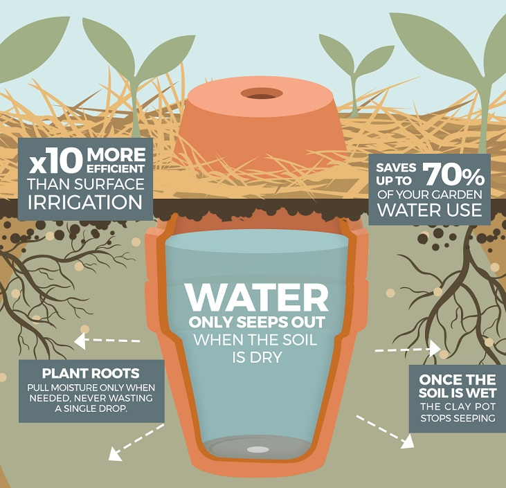

# Homestead Monitoring

Automated monitoring for a garden using:
- **Olla Irrigation** (passive watering)
- **Solar Power** (off-grid)
- **ESP32 Microcontroller** (active monitoring brain)
- **ntfy Push Notifications** (phone alerts)

This project is designed for hot, arid climates where plants are exposed to very extreme temperatures and dry conditions. The goal is to build an automated monitoring system that helps monitor soil moisture and temperature to avoid crop loss. This is a hobby project and will be expanded over time.

## Repository Structure

homestead-monitoring
├── README.md
├── firmware
│   └── esp32-olla-monitor.ino       ← coming soon
└── docs
    ├── supplies.md                  ← full BOM with links and quantities
    └── wiring.md                    ← ESP32 pin map and power path


## 1) Project Goals

- Keep fruit and vegetable root zones in a healthy moisture range throughout the season.
- Alert when moisture falls below tolerance so the Olla can be refilled before plants show stress.
- Run reliably outdoors through high heat, UV exposure, and dust.
- Start with a single bed/zone and support expansion to multiple zones over time.

## 2) How the System Works

1. A capacitive soil moisture sensor is placed in the root zone, near (but not touching) the Olla.
2. The ESP32 microcontroller wakes on a schedule and reads the sensor.
3. Readings are filtered and converted to a moisture percentage using dry/wet calibration values.
4. If moisture stays below a set threshold for a sustained period, the ESP32 sends an `ntfy` push alert to your phone (only during waking hours).
5. You refill the Olla reservoir. Once soil moisture recovers above the recovery threshold, the system sends a confirmation and clears the alert state.



## 3) Shopping List

The full Bill of Materials with product links, quantities, and specs is in [`docs/supplies.md`](docs/supplies.md).

## 4) Placement Guidelines (Critical for Accuracy)

- Place the moisture probe **3–6 inches from the Olla body**, in the active root zone.
- Probe depth should match the typical root depth of your target crops.
- Do not place the probe too close to the Olla wall — it will read artificially wet and mask real dry conditions elsewhere.
- Route cables away from direct afternoon sun where possible to reduce heat-related wear.
- Mount the enclosure in a shaded spot and elevated above the splash zone.

## 5) Firmware Logic (High Level)

The core loop uses:
- **Periodic sampling** — wake every 5–15 minutes to read the sensor
- **Rolling average** — smooth out noise from soil contact variation
- **Hysteresis** — separate thresholds for triggering vs. clearing an alert, to prevent flapping
- **Cooldown timer** — minimum time between alerts to prevent notification spam

Pseudo logic:

```cpp
readRawMoisture();
moisturePct = mapToPercent(raw, dryCal, wetCal);
smoothed = movingAverage(moisturePct);

if (smoothed < lowThreshold && cooldownExpired) {
  sendNtfy("Low moisture: refill Olla soon");
  markAlertSent();
}

if (smoothed > recoveryThreshold) {
  clearLowState();
}
```

Recommended starting thresholds (tune to your crops and soil):
- `lowThreshold`: 20–30%
- `recoveryThreshold`: 30–40%
- `cooldown`: 4–12 hours depending on crop sensitivity and how fast your soil dries

## 6) Calibration Procedure

Do this before deployment, and repeat seasonally as soil composition changes:

1. **Dry reference**
   - Place the probe in dry potting mix representative of your bed.
   - Record 20–50 readings and average them — this is `dryCal`.
2. **Wet reference**
   - Saturate the same mix to field capacity (moist throughout, but no standing water).
   - Record 20–50 readings and average them — this is `wetCal`.
3. **Map conversion**
   - Convert each raw reading to a percentage between your dry and wet bounds.
4. **Field tuning**
   - Observe 7–10 days in real conditions and adjust thresholds for each crop group or season.

## 7) Alerting with ntfy

Use a private topic name and an optional access token for security.

Basic HTTP publish pattern (for testing):

```bash
curl -H "Title: Garden Alert" \
     -H "Priority: high" \
     -d "Moisture below threshold. Refill Olla." \
     https://ntfy.sh/<your-topic>
```

The ESP32 sends equivalent HTTPS POST requests from its firmware.

Recommended notification types:
- **Low moisture alert** — primary actionable alert
- **Critical moisture alert** — optional second threshold for urgent conditions
- **Recovery confirmation** — sent when soil rebounds after refill
- **Sensor fault warning** — triggered by out-of-range or disconnected readings
- **Battery low warning** — if battery telemetry is added later

## 8) Power Budget (Starter Sizing Method)

Estimate daily energy draw by adding:
- **ESP32 active current** (~240mA with Wi-Fi) × active minutes per day
- **ESP32 deep sleep current** (~10µA) × sleep minutes per day
- **Sensor and regulator overhead** (~12mA while awake: 2× moisture sensors + temp probe)
- **Buck converter quiescent** (~5mA continuously, even during sleep)
- **Weather margin** — assume 2–3 cloudy days in a row as your worst case

Example for a 10-minute sample interval (ESP32 active ~15 seconds per cycle):
- 144 wake cycles/day × 15s = ~36 minutes active, ~1,404 minutes sleeping
- Active draw at 6V battery: ~247mA × 0.6h = **~148mAh/day**
- Sleep draw at 6V battery: ~5mA × 23.4h = **~117mAh/day**
- **Total: ~265mAh/day**

Estimated autonomy on a full 6V 6Ah LiFePO4 charge (no solar):
- **Best case** (full rated capacity): 6,000mAh ÷ 265mAh/day ≈ **~23 days**
- **Practical** (80% depth of discharge): 4,800mAh ÷ 265mAh/day ≈ **~18 days**

The 10W panel at 4–5 peak sun hours/day produces ~5,600mAh/day — far more than the ~265mAh/day consumed, so the panel will fully recharge the battery in any normal day of sun.

Design targets:
- **3+ days autonomy** without any sun input ✓ (actual headroom is ~2-3 weeks)
- Panel sized to fully recharge daily use plus a recovery margin ✓

## 9) Build and Commissioning Checklist

### Bench Test (Indoor)

- Wire ESP32, moisture sensor, and temperature probe together.
- Verify stable ADC readings across the expected voltage range.
- Verify Wi-Fi reconnect behavior after a reboot.
- Trigger test alerts and confirm delivery to your phone.

### Dry Run (No Soil)

- Simulate dry/wet transitions by moving the probe between dry air and a cup of water.
- Validate that threshold and cooldown behavior fires and clears correctly.

### Field Install

- Place the sensor at the target depth and distance from the Olla.
- Install mulch layer over the bed.
- Seal the enclosure and all cable glands.
- Monitor readings continuously for the first week before relying on alerts.

### First Week Tuning

- Log refill times and corresponding moisture minima.
- Adjust thresholds to catch low moisture earlier if plants are showing any stress.
- Confirm no repeated or spurious alerts are firing.

## 10) Project Roadmap

### Phase 1 — Documentation and Procurement

~~- Finalize supplies with exact quantities and sources.~~
- Prepare wiring diagram and ESP32 pin map.

### Phase 2 — Single-Zone Prototype

- Build one sensor node and validate end-to-end alert flow.
- Commission in field and tune thresholds for first crop group.

### Phase 3 — Field Reliability

- Tune for seasonal heat swings and changing soil conditions.
- Add battery telemetry and low-voltage alerts.

### Phase 4 — Expansion (Future)

- Multi-zone monitoring with multiple independent sensor nodes.
- Optional dashboard (Home Assistant or Grafana) for historical trend tracking.
- Optional automated refill assist or valve control if desired.

## 11) TODO

~~1. Create `docs/supplies.md` — exact product links, quantities, and per-unit costs.~~
~~2. Create `docs/wiring.md` — ESP32 pin map, power path diagram, and cable routing notes.~~
3. Create `firmware/esp32-olla-monitor.ino` starter sketch with:
   - calibration constants (`dryCal`, `wetCal`),
   - rolling average filter,
   - threshold and hysteresis logic,
   - ntfy HTTPS notification function.
